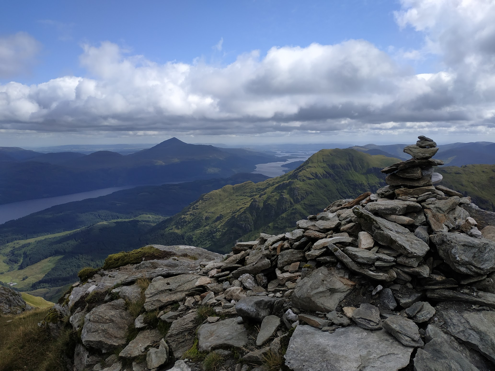
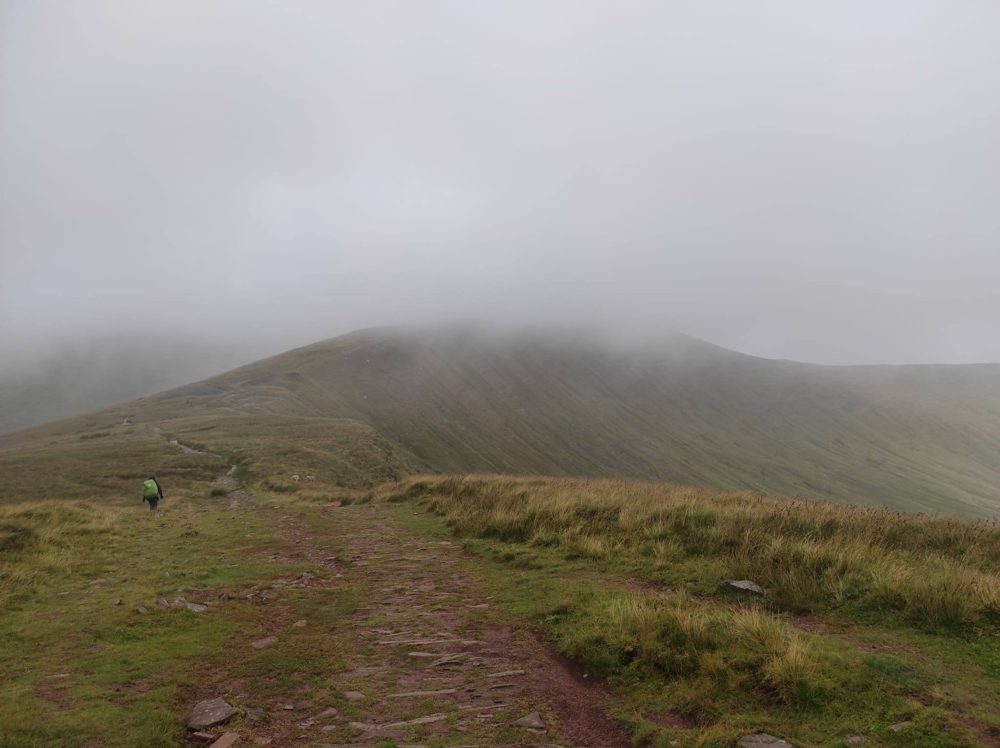
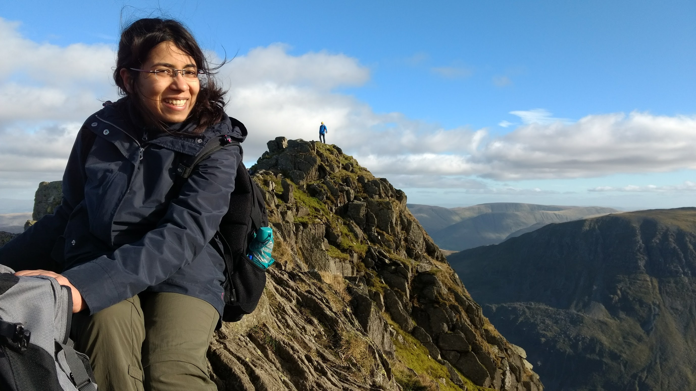
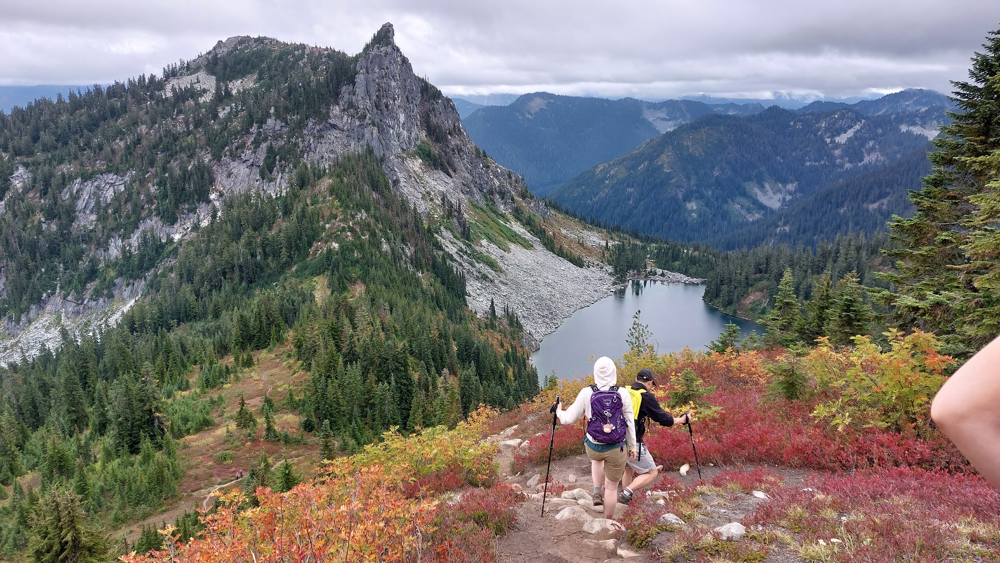
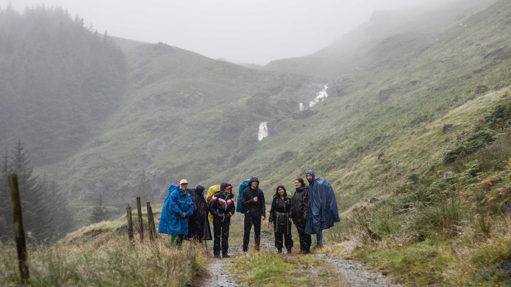

When I'm not reading neuroscience or mathematics, I'm enjoying modern art - fiction, poetry, visual arts -, listening to podcasts, watching cinema, and occasionally on a hike!

Here are some recommendations, arbitrarily updated at times based on a Poisson process...

### Literature
- [The Waves](https://www.goodreads.com/book/show/46114.The_Waves_) by Virginia Woolf. 
A patchwork of moments and perspectives, solitary and shared, is all that life is... Discontinuous, or perhaps with overlapping strands, some of which end abruptly without resolution - like waves crashing upon the shore. Is there a real boundary that demarcates you from the world? The years constrain you, make you less diffuse, but that solidity is often an external apparition. If you could access the inner world of every individual, like you do in this book, you would know that everything is in motion. Narrated via internal monologues of six friends over the course of their not-entirely-separate-yet-divergent lives, it captures the subjectivity of events and moments. It brings out the sensitivity, this shared human quality, in the most certain, vain, or self-doubting person.

- [The Copenhagen trilogy](https://www.goodreads.com/book/show/53317528-childhood-youth-dependency) by Tove Ditlevsen. 
This book, the lyricism, the melancholy will haunt my soul for a while..

- [The Price of Peace](https://www.goodreads.com/book/show/49644992-the-price-of-peace) by Zachary D. Carter. 
A biography of John Maynard Keynes - his intellectual, political and economic legacy, his contributions to American and British wartime and inter-war rebuilding efforts, his love for the arts, and how neoliberalism dissolved the hope for a fairer world by (for now) beating even his moderate socialism.

- [Capital and Ideology](https://www.goodreads.com/book/show/50849430-capital-and-ideology) or [Capital in the Twenty-First Century](https://www.goodreads.com/book/show/18736925-capital-in-the-twenty-first-century) by Thomas Piketty on the nature of political economies. 
Choose the former if you are interested in historical accounts of how different material and ideological factors created the different economic structures across civilizations and time. Choose the latter if you want to have empirically-backed arguments about inequality and concentration of wealth in the 21st century.

- [Impure Science](https://www.goodreads.com/book/show/693573.Impure_Science) by Steven Epstein. 
AIDS, Activism, and the Politics of Knowledge - the construction of "certainty" is as much a social and political phenomenon as it is a scientific one. From the conceptualisation of the hypothesis space to the commercialization of scientific knowledge to the widespread acceptance or credibility of scientific "truths", the dynamics between scientists, institutions and the public play out within a historical and socio-cultural context.

### Poetry
- [Blue Estuaries](https://www.goodreads.com/book/show/1522562.The_Blue_Estuaries) by Louise Bogan. Emotive and forceful, her poetry aims to consume the spirit.

- [Faithful and Virtuous Night](https://www.goodreads.com/book/show/20613826-faithful-and-virtuous-night) by Louise Gluck. "Travelling backwards and forwards in time surges up reflections which coalesce in a continuum of insomnia and dreams, a consciousness mirroring the transience as well as the circularity and immutability of life. Living is embracing the living past."

- [Poems New And Collected](https://www.goodreads.com/book/show/10205.Poems_New_And_Collected) by Wisława Szymborska. Witty, insightful, occasionally funny, and deeply human. Easily reread.

### Cinema

I have a strong preference for languid, introspective films - conversations filled with silences, lingering shots, dusty cities coming alive at night, human movement as a choreography through scenes. These include New Wave and contemporary directors both in Europe and South/East Asia. Here's a non-exhaustive list of some recommendations from this "genre":

- Hou Hsiao-Hsien and Edward Yang ([Taiwanese New Wave](https://www.criterion.com/current/posts/7989-taiwanese-new-waves-in-new-york)). 
"Hou’s tranquil style favored a contemplative mood and muted emotion, while Yang’s elliptical editing technique, reminiscent of Resnais, fractured time and space, while his compositions had a painterly starkness...". Start with [Yi Yi](https://www.criterion.com/films/781-yi-yi), [Taipei Story](https://www.criterion.com/films/29110-taipei-story), or [The Boys from Fengkui](https://www.criterionchannel.com/the-boys-from-fengkuei).

- [The Oslo Trilogy](https://www.youtube.com/watch?v=yERWfV_sHuM) by Jochem Trier.
"The three films in Trier’s trilogy are as much documents of a city in flux as they are portraits of people questioning their role in life and what place self-expression might play in it."

- [Subarnarekha](https://www.youtube.com/watch?v=jeiGPWYIOqs) by Ritwik Ghatak.  contemporary of the better-knon Satyajit Ray, his films are equally incisive portraits of post-independence social realities in India and the paradoxes of modernization.

- [Fallen Leaves](https://mubi.com/en/us/films/fallen-leaves-2023) by Aki Kaurismäki. Perseverance presents itself in delicate and comedic ways. With wonderful use of color, music and brilliantly understated acting.

### Hiking
And some moments of peace among the hills!
From top to bottom: View of Loch Lomond in Trossachs National Park in Scotland, Pen y Fan in Brecon Beacons in Wales, Helvellyn Ridge in Lake District in Northern England, and Lake Valhalla in Okanogan-Wenatchee National Forest in Washington. And lastly, the realities of hiking in the UK!

